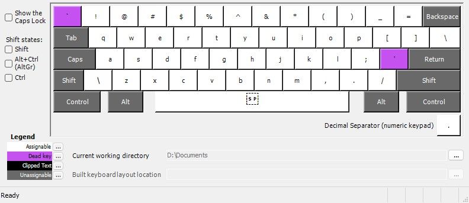
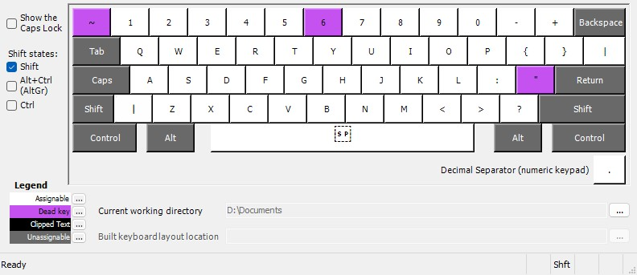

# keyboards
Just a repo with custom config for my programming keyboard as it is the main use on a daily basis.
It's just the EN-US layout with just the number row shifted from 1 to '-'. Makes it easier on the hands while typing most part of the day.

## Windows
There's the installer and the .klc if you want to make some changes using [msklc](https://www.microsoft.com/en-us/download/details.aspx?id=102134) *(make sure you install it directly under the drive's root since it fails to make the .dll's if not)*.

